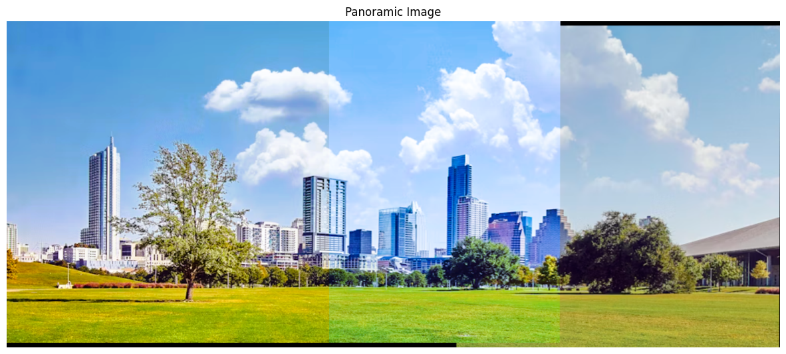

# Computer Vision Panoramic Image Stitching

This project focuses on panoramic image stitching using computer vision techniques. The code provided here is implemented in a Jupyter Notebook environment.

## Requirements

- Python 3.x
- OpenCV (cv2)
- NumPy
- Matplotlib

## Usage

1. Ensure you have the required libraries installed.
2. Place your input images in the specified directory (`imagenes/input0` by default).
3. Run the code cells in the Jupyter Notebook sequentially.

## Functionality

### Homography Estimation

The code utilizes the SIFT algorithm to detect and describe local features in two images, finding correspondences between them. FLANN (Fast Library for Approximate Nearest Neighbors) with a KD-Tree index is then employed for efficient feature matching. RANSAC algorithm is used to estimate a robust homography matrix to transform coordinates from one image to another.

### Warping

The warping function integrates two images with different perspectives or scales. It applies a perspective transformation to the image based on the calculated homography matrix using `cv2.warpPerspective`.

### Blending

A blending algorithm is implemented to smoothly combine overlapping regions of two images. It calculates a gradient mask to control the opacity of each image in the overlapping region, achieving a visually pleasing transition.

## Result

The final panoramic image will be displayed after executing the provided code cells. Below is an example illustrating the process:

- Image without Blending:
  

- Final Panoramic Image:
  

## Conclusion

This project demonstrates the use of computer vision techniques for panoramic image stitching, enabling the creation of seamless panoramic views from multiple input images. For further customization or improvement, feel free to adjust the parameters or algorithms according to your specific requirements.
